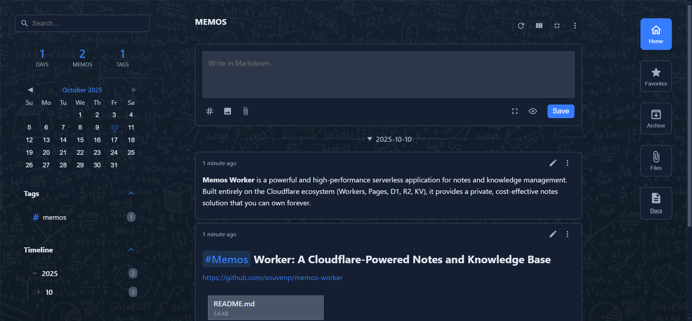
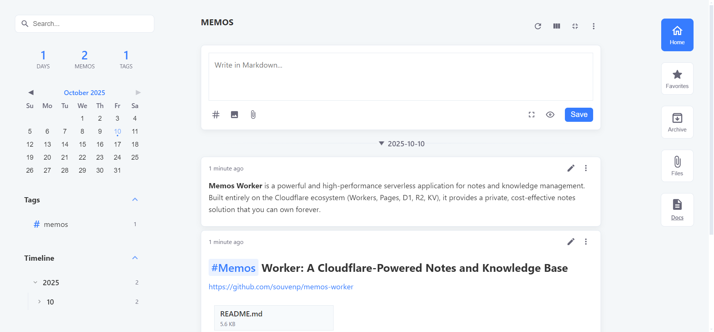
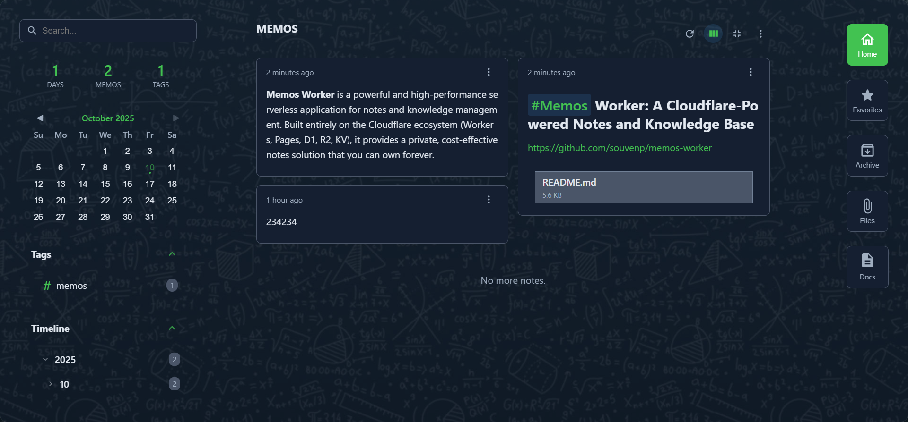
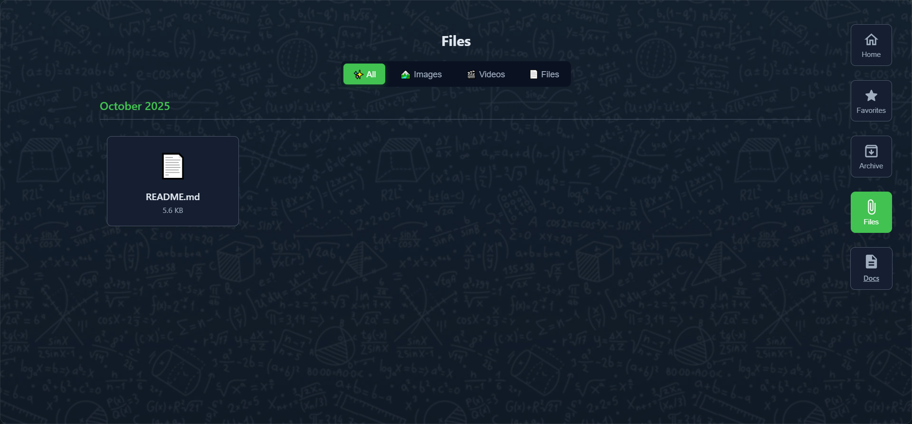

[中文](./README_zh.md)

# Memos Worker: A Cloudflare-Powered Notes and Knowledge Base






**Memos Worker** is a powerful and high-performance serverless application for notes and knowledge management. Built entirely on the Cloudflare ecosystem (Workers, Pages, D1, R2, KV), it provides a private, cost-effective notes solution that you can own forever.

## ✨ Features

-   **✍️ Full-featured Markdown Support**: Supports real-time preview, split-screen editing, and smart pasting from rich text to Markdown.
-   **🎛️ Flexible Views & Workflow**: Manage notes via archiving, favoriting, and pinning. Customize your display with list, waterfall, and date-grouped views.
-   **🗂️ Files & Attachments**: Supports drag-and-drop or pasting to upload images (to R2 or Imgur) and various file types.
-   **🔗 Public Sharing**: Generate unique, publicly accessible links for any individual memo or file within your notes, with optional expiration times.
-   **🤖 Telegram Integration**: Record text, images, videos, and files on the go via a Telegram Bot, with a proxy option to save storage space.
-   **📚 Powerful Organization**: Automatic tagging, full-text search, timeline, calendar, and a contribution heatmap.
-   **📃 Knowledge Base (Docs)**: A separate, tree-structured documentation center, perfect for building organized knowledge systems.
-   **🎨 Highly Customizable**: Light/dark themes, custom primary colors, background images, glassmorphism effects, and fine-grained layout and feature visibility adjustments.
-   **🚀 High Performance & Low Cost**: Blazing fast responses powered by the Cloudflare global network, running at virtually zero cost on the free tier.

## 🚀 Deployment Guide

### Step 1: Choose Your Repository Creation Method

You have two ways to create your own code repository. Please choose one based on your needs.

#### Option A: Fork (Recommended, for easy updates)
-   **Pros**: Your repository remains linked to the original. When new features or bug fixes are released, you can easily sync these updates from GitHub.
-   **Cons**: Your code repository **must be public**.
-   **Action**: Click the **"Fork"** button at the top-right of this page.

#### Option B: Use this template (For a private repository)
-   **Pros**: You can create a new, completely independent, and **private** code repository.
-   **Cons**: Your repository will be detached from the original project, making it **difficult to get future updates automatically**. You will need to manually sync changes using Git commands, which can be complex.
-   **Action**: Click **"Use this template"** -> **"Create a new repository"** at the top-right of this page.

### Step 2: Create Cloudflare Resources

You need to manually create the necessary D1, R2, and KV resources in your Cloudflare Dashboard.

| Resource Type | Recommended Name | Binding Variable Name |
| ----------------- | ----------------- | --------------------- |
| **D1 Database** | `notes-db` | `DB` |
| **KV Namespace** | `notes-kv` | `NOTES_KV` |
| **R2 Bucket** | `notes-r2-bucket` | `NOTES_R2_BUCKET` |

1.  **Create D1 Database (`notes-db`)**:
	-   Go to **Workers & Pages** -> **D1** -> **Create database**.
	-   **Important**: After creation, go to the database's console, copy and execute the entire content of the `schema.sql` file.
	-   **Important**: Note down the `database_id` and `database_name`. Open your local `wrangler.toml` file and fill them into the `[[d1_databases]]` section.

2.  **Create KV Namespace (`notes-kv`)**:
	-   Go to **Workers & Pages** -> **KV** -> **Create a namespace**.
	-   **Important**: Note down the `id`. Fill it into the `[[kv_namespaces]]` section of your `wrangler.toml` file.

3.  **Create R2 Bucket (`notes-r2-bucket`)**:
	-   Go to **R2** -> **Create bucket**.
	-   **Important**: Note down the `bucket_name`. Fill it into the `[[r2_buckets]]` section of your `wrangler.toml` file.

4.  **Commit and Push**: Save the changes to your `wrangler.toml` file and push them to your GitHub repository.

### Step 3: Deploy to Cloudflare Workers

1.  In your Cloudflare Dashboard, go to **Workers & Pages** -> **Create application** -> **Select the "Workers" tab**.
2.  Click **"Connect with Git"** and choose your forked repository.
3.  Click **Save and Deploy**.

### Step 4: Configure Environment Variables

After deployment, go to your new Worker's settings to add secrets.

1.  Navigate to your Worker's project -> **Settings** -> **Variables**.
2.  Under **Environment Variables**, add the following variables. Remember to click `Encrypt` for sensitive values.

	| Variable Name           | Description                                  |
    | ----------------------- | -------------------------------------------- |
	| `USERNAME`              | Your login username                          |
	| `PASSWORD`              | Your login password                          |
	| `TELEGRAM_BOT_TOKEN`    | (Optional) Your Telegram bot's token         |
	| `TELEGRAM_WEBHOOK_SECRET` | (Optional) A long, random string for webhook security |
	| `AUTHORIZED_TELEGRAM_IDS` | (Optional) Your Telegram user ID to authorize |

3.  Trigger a new deployment from the "Deployments" tab to make the variables effective.

### Step 5: (Optional) Activate Telegram Webhook

If you configured the Telegram variables, you need to activate the webhook once.

1.  Get your Worker's URL (e.g., `https://your-project.pages.dev`).
2.  Construct the following webhook activation URL in your browser's address bar:
	```
	https://api.telegram.org/bot<TELEGRAM_BOT_TOKEN>/setWebhook?url=https://your-project.pages.dev/api/telegram_webhook/<TELEGRAM_WEBHOOK_SECRET>&secret_token=<TELEGRAM_WEBHOOK_SECRET>
	```
3.  **Replace** `<TELEGRAM_BOT_TOKEN>` and `<TELEGRAM_WEBHOOK_SECRET>` with your actual secret values.
4.  Press Enter. If you see `{"ok":true,"result":true,"description":"Webhook was set"}`, it's successful! You can now send messages to your bot.

---

> Alternatively, you can deploy directly from the command line using Wrangler. (This guide is based on `wrangler@^4.33.0`).
>
> 1.  Clone the repository locally and fill in the `wrangler.toml` file with your configurations for KV, D1, and R2.
> 2.  Run the command: `npx wrangler deploy`

## 💡 Tips

-   **Preview Raw Files**: In the main interface or on a public share page, you can **right-click** on any text-based file attachment (like `.txt`, `.md`, `.json`, `.js`) to open its raw content directly in a new tab.
-   **Understanding "Telegram Proxy"**: This setting (found in the Settings panel) controls how videos and files from Telegram are handled.
	-   **Proxy ON**: Saves R2 storage space. Your Worker creates a link that *proxies* to Telegram's file. **Risk**: If the original file is deleted from Telegram, your link will break.
	-   **Proxy OFF**: Uses R2 storage. Your Worker downloads the file from Telegram and re-uploads it to your R2 bucket, ensuring you have a permanent copy.
-   **Understanding "Keep Time"**: When editing a note, you'll see a "Keep Time" checkbox.
	-   **Checked (Default)**: When you save the edit, the note's original timestamp will be preserved. It will **not** jump to the top of your timeline.
	-   **Unchecked**: When you save, the note's timestamp will be updated to the current time, making it the most recent note.

## 🔧 Development (Wrangler)

### 1. Local Development (Simulated Environment)

**Initialize local database**:
```bash
npx wrangler d1 execute YOUR_D1_NAME --local --file=./src/schema.sql
```

**Start the dev server**:
```bash
npx wrangler dev
```

### 2. Local Development (Connected to Cloud Resources)

This mode connects your local dev server to your actual Cloudflare resources.

1.  **Configure `wrangler.toml`**: Ensure the resource IDs from your Cloudflare Dashboard are filled in this file.
	```toml
	# wrangler.toml
	[[d1_databases]]
	binding = "DB"
	database_name = "notes-db"
	database_id = "YOUR_D1_DATABASE_ID" # Replace

	[[kv_namespaces]]
	binding = "NOTES_KV"
	id = "YOUR_KV_NAMESPACE_ID" # Replace

	[[r2_buckets]]
	binding = "NOTES_R2_BUCKET"
	bucket_name = "notes-r2-bucket"
	```
2.  **Create `.dev.vars` file**: Create this file in the project root for your local secrets.
	```ini
	# .dev.vars (This file is ignored by Git)
	USERNAME="dev_user"
	PASSWORD="dev_password"
	```
3.  **Start the remote-connected dev server**:
	```bash
	npx wrangler dev --remote
	```
